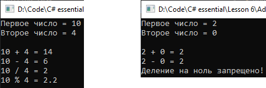

# Lesson6_addition_task
Условия задачки:
>Используя Visual Studio, создайте проект по шаблону Console Application.  
Требуется:  
Создать статический класс Calculator, с методами для выполнения основных арифметических операций. 
Написать программу, которая выводит на экран основные арифметические операции. 

Подытог: вот такенный майндфак на выходе
>
